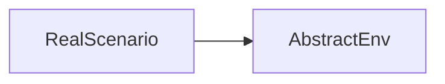

# ModelTest

To start your Phoenix server:

  * Run `mix setup` to install and setup dependencies
  * Start Phoenix endpoint with `mix phx.server` or inside IEx with `iex -S mix phx.server`

Now you can visit [`localhost:4000`](http://localhost:4000) from your browser.

Ready to run in production? Please [check our deployment guides](https://hexdocs.pm/phoenix/deployment.html).

## Learn more

  * Official website: https://www.phoenixframework.org/
  * Guides: https://hexdocs.pm/phoenix/overview.html
  * Docs: https://hexdocs.pm/phoenix
  * Forum: https://elixirforum.com/c/phoenix-forum
  * Source: https://github.com/phoenixframework/phoenix

## why?
现有的多智能体仿真项目，所有的智能体都是提前给了链接关系，但是在实际场景中，智能体和智能体之间的链接是随着时间在不停变化的，本项目就是要在一个随时变化的评测场景中，给出一个具体的评测任务的demo

## how?
本项目的实现过程分成以下几个步骤：
- 抽象core的开发
- 规则的抽象
- 评测场景具体应用
- 提供api操作项目中的某些智能体
- 提供可视化界面，类似聊天室的交互形式
- 将core，抽象规则，api封装成SDK，支持新项目的快速实现

## pipeline
这个demo的演示包含以下几个功能：
- 项目启动后弹出一个前端页面，上面是一个聊天框
- 有一个表单，可以提供输入问题数据，可以自动的在聊天框上展示不同智能体的对话数据
- 整个评测项目中分为三类智能体：QA智能体，通过传入问题给出结果；评测智能体，当接收到QA数据之后给出具体的评判结果，总结智能体，当接收到QA以及对应的评判数据给出一个总结

  
## 抽象core
 ### 抽象环境

在AbstractEnv中封装了大量的相似操作，对于具体环境而言，对环境的操作就等于对这个抽象环境的操作，比如说对场景的启动，暂停，保存，加载等

### 环境状态

所谓的环境状态是在core中环境这个模块的属性集合，后续所有的操作都是围绕着对这个状态进行增删改查操作

## 规则的抽象

## 评测场景具体应用
  ### 评测环境

## api

## 可视化界面
前端项目，svelte实现，详细见model_test_frontend项目

## SDK