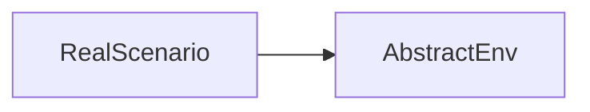
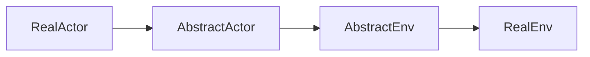
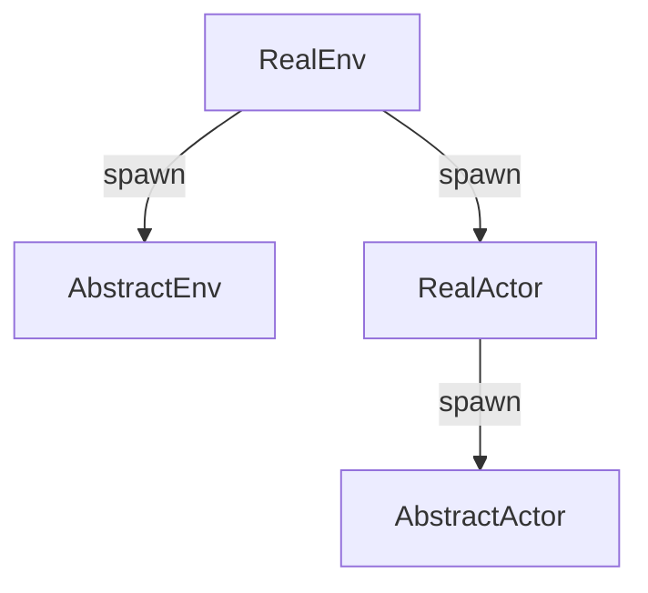

# ModelTest

## why?
现有的多智能体仿真项目，所有的智能体都是提前给了链接关系，但是在实际场景中，智能体和智能体之间的链接是随着时间在不停变化的，本项目就是要在一个随时变化的评测场景中，给出一个具体的评测任务的demo

## how?
本项目的实现过程分成以下几个步骤：
- 抽象core的开发
- 规则的抽象
- 评测场景具体应用
- 提供api操作项目中的某些智能体
- 提供可视化界面，类似聊天室的交互形式
- 将core，抽象规则，api封装成SDK，支持新项目的快速实现

  
## 抽象core
 ### 抽象环境

在AbstractEnv中封装了大量的相似操作，对于具体环境而言，对环境的操作就等于对这个抽象环境的操作，比如说对场景的启动，暂停，保存，加载等

在和其余智能体交互的时候，比如某个自定义的智能体和环境智能体进行交互，消息的过程是

消息回传就是上手过程反过来，之所以这么做，是因为在并发系统中，会出现大量的死锁或者延迟等其他系统内的问题，我们将所有可能出现的问题放在两个抽象文件中进行处理完成。

在实例化的时候，如果想要实例出一个真正的actor，和四个actor之间的关系为：

### 环境状态

所谓的环境状态是在core中环境这个模块的属性集合，后续所有的操作都是围绕着对这个状态进行增删改查操作

## 规则的抽象

## 评测场景具体应用
  ### 评测环境

## api

## 可视化界面
前端项目，svelte实现，详细见model_test_frontend项目

## SDK

## 开发需求
### core部分需求
- [x] 抽象环境模块
- [x] 抽象环境模块的状态定义
- [x] 抽象智能体模块
- [x] 抽象智能体模块的状态定义
### demo scenario需求
demo场景围绕着模型评测展开，能够完成以下几个需求：
- [ ] 项目运行起来之后，能够在一个前端页面上看到创建新评测，加载历史评测选择框
- [ ] 点击创建新评测之后，进入到一个类似聊天室的交互页面，新创建了之后什么信息都不会有
- [x] 提供创建智能体的api，当点击左边创建智能体可以输入智能体的类型，智能体的名字（可以不输入）从而在聊天室中创建对应的智能体
- [x] 提供控制智能体的api，当前只开发question智能体的控制api，能够输入api的名字，让给它一条要询问的问题，完成自动在系统中寻找到answer智能体给它解答，critic智能体能够完成一段总结工作的pipeline

### demo scenario开发需求
- [x] 具体环境模块的实现
- [x] question智能体模块的实现
- [x] answer智能体模块的实现
- [x] critic智能体模块的实现
- [x] 具体环境状态模块的定义
- [x] question智能体状态模块的定义
- [x] answer智能体状态模块的定义
- [x] critic智能体状态模块的定义
- [ ] 具体场景抽象图连接规则的定义

### 后端接口
- [x] 家目录接口 "/"
- [x] 创建一个新的评测 "/new"
- [x] 创建一个新的智能体 "/new_actor"
- [x] 给question智能体传入一个问题文本 "/question"
- [x] 根据固定频率访问后端，获取最新的环境状态数据 "/get_game_observation"